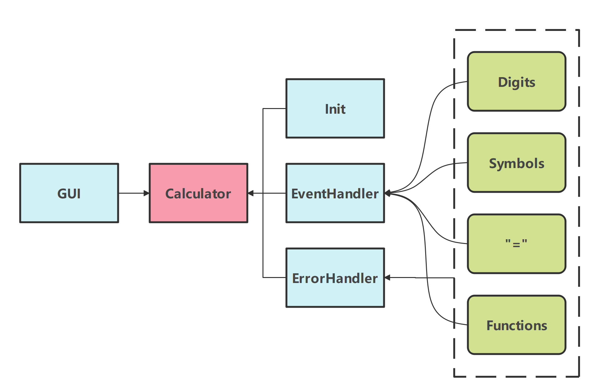
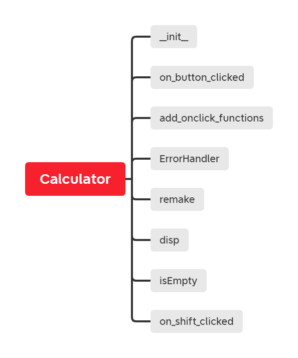
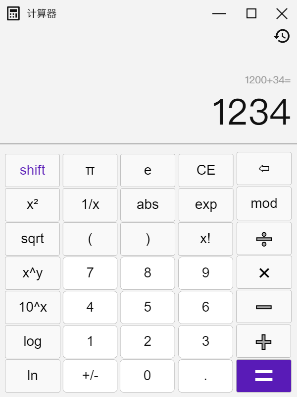
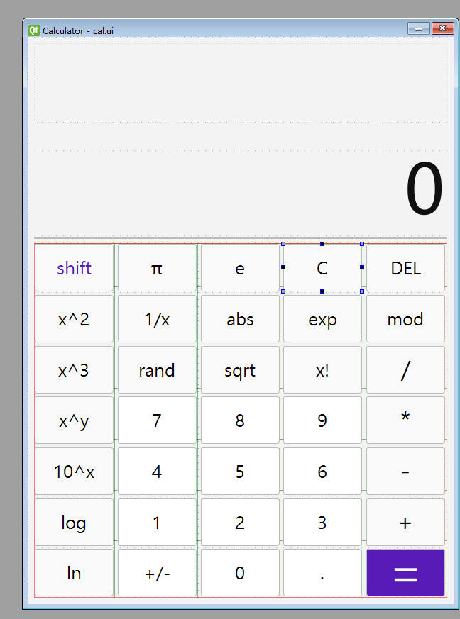
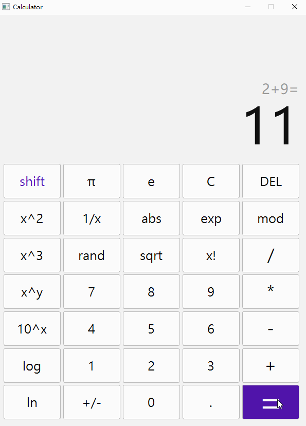
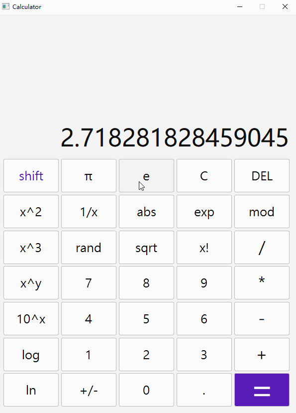
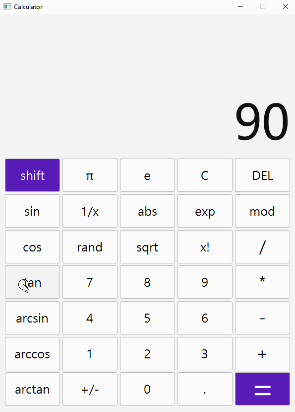
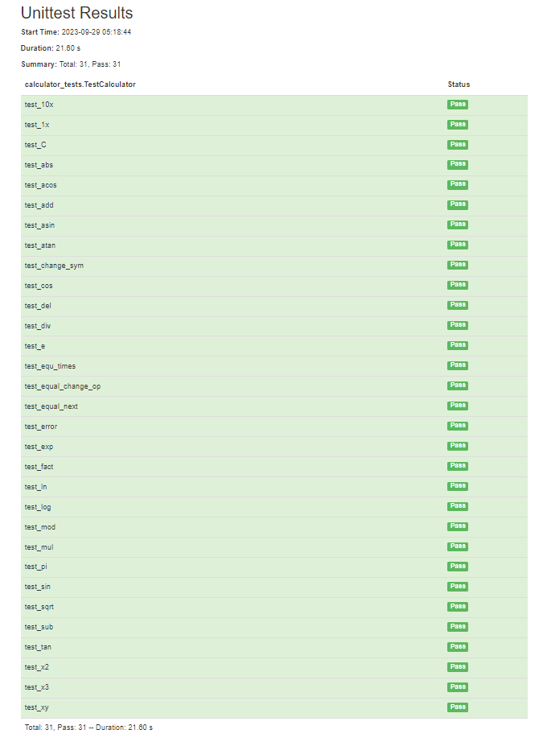
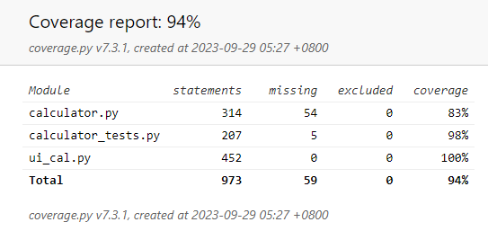
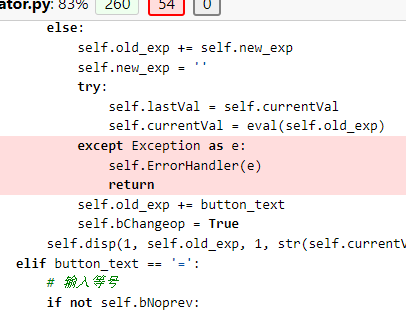

# 软件工程第一次作业——PyQt实现可视化科学计算器

学号：102101526 	姓名：易华章


[toc]

## 作业基本信息

|这个作业属于哪个课程|[2301-计算机学院-软件工程](https://bbs.csdn.net/forums/ssynkqtd-05)|
|--    |--    |
|这个作业要求在哪里|[软件工程实践第一次作业](https://bbs.csdn.net/topics/617294583)|
|这个作业的目标| 实现一个简易计算器，具有图形化界面      |
|其他参考文献| [pyqt5_docs](http://pyqt.sourceforge.net/Docs/PyQt5/) |


## Gitcode项目地址

[Python简单科学计算器](https://gitcode.net/yihzh/SE_Assignment1)


## PSP表格

| PSP                                     | Personal Software Process Stages        | 预估耗时（分钟） | 实际耗时（分钟） |
| :-------------------------------------- | :-------------------------------------- | :--------------- | :--------------- |
| Planning                                | 计划                                    | 30               | 30               |
| • Estimate                              | • 估计这个任务需要多少时间              | 30               | 30               |
| **Development**                         | **开发**                                | **700**          | 830              |
| • Analysis                              | • 需求分析 (包括学习新技术）            | 240              | 150              |
| • Design Spec                           | • 生成设计文档                          | 30               | 60               |
| • Design Review                         | • 设计复审                              | 10               | 10               |
| • Coding Standard                       | • 代码规范 (为目前的开发制定合适的规范) | 10               | 10               |
| • Design                                | • 具体设计                              | 20               | 30               |
| • Coding                                | • 具体编码                              | 300              | 480              |
| • Code Review                           | • 代码复审                              | 60               | 30               |
| • Test                                  | • 测试（自我测试，修改代码，提交修改）  | 30               | 60               |
| **Reporting**                           | **报告**                                | **30**           | 35               |
| • Test Repor                            | • 测试报告                              | 10               | 5                |
| • Size Measurement                      | • 计算工作量                            | 10               | 10               |
| • Postmortem & Process Improvement Plan | • 事后总结, 并提出过程改进计划          | 10               | 20               |
|                                         | **合计**                                | **760**          | 925              |


## 解题思路描述

​	开始一看到题目，要实现一个有图形化界面的计算器，觉得普通的计算器比较好做，就打算学点之前没学过的，功能也做多一点。正好这次要做GUI，就跑去学了`PyQt5`，感觉是比`tkinter`复杂一点，但是好在功能比较全，代码也比较好写。代码风格就是Python标准的`PEP 8`。

​	具体的解题思路就是先做好一个图形界面，然后去设计计算模块，实现输入表达式的存储和计算，最后把计算功能绑定到每个按钮上。

### 项目设计

在初步分析里，项目被我分为7个部分：

1. 分析题目，列出所需的库，比如`PyQt5`、`unittest`、`coverage`等
2. 学习相关技术，同时搜索类似的项目和示例代码
3. 分析需求，包括支持哪些的运算符、要做哪些特殊函数、界面布局、样式等
4. 在原型设计软件里设计好程序的原型
5. 用一两天实现程序代码和debug
6. 学一学单元测试，写一写测试用例，测试一下自己的程序，算出覆盖率
7. 写Blog


## 接口设计和代码实现

我把计算器分为两个模块：计算器本体和GUI，GUI只提供图像界面，所有的计算功能都在本体实现。




### 计算器本体

由于Python有巨好用的`eval()`，所以只要维护左边的运算表达式、新的运算表达式和当前运算符就行了，主要采用面向对象的编程方式，用模块来组织和管理代码，计算器主体是`Calculator`类：

```python
class Calculator(QtWidgets.QWidget)
```



- `__init__`、`add_onclick_functions`：初始化一些变量和设置界面
- `on_button_clicked`、`on_shift_clicked`：按钮点击事件的处理函数，根据按钮的不同执行相应的操作
- `ErrorHandler`：错误处理和异常情况处理，当用户输入无效的表达式或发生数学错误时，捕获异常并提供合适的错误信息
- `remake`、`isEmpty`：处理函数中用到的一些操作，封装起来方便修改
- `disp`：用于显示表达式和计算结果

现在详细介绍每一个函数。

#### init

```python
def __init__(self):
    super().__init__()
    self.old_exp = ""
    self.new_exp = ""
    self.currentVal = 0  # Currently displayed number
    self.lastVal = 0  # Number before operation
    self.bChangeop = False  # Flag for changing operation
    self.bInv = False  # Inverse on/off flag
    self.bNoprev = True  # Flag for previous equals
    self.bDot = False  # Flag for has a dot
    self.holdVal = ''  
    # holding the second operand in repetitive calculations
    self.shift_change = False
    self.ui = Ui_Calculator()
    self.ui.setupUi(self)
    self.ui.btn_shift.clicked.connect(self.on_shift_clicked)
```

上半部分是一些变量的初始化，下半部分是gui界面渲染，为了完成计算，使用了`old_exp`和`new_exp`来维护左运算表达式和右运算表达式，用`currentVal`和`lastvalue`用于存储实际的值，再定义一些flag用来实现小功能。


#### add_onclick_functions

```python
def add_onclick_functions(self):
	buttons = self.findChildren(QPushButton)
	for button in buttons:
		button.clicked.connect(self.on_button_clicked)
```

利用“信号和槽”机制把函数绑定到每个按钮上面，具体实现其实就是一个connect函数。


#### on_button_clicked/on_shift_clicked

计算器核心的处理函数，这里把按钮功能分为四种：

- 数字：0-9，`.`，`+/-`
- 运算符号：+ - * / ^ %
- 等号
- 函数

针对这四种写不同的处理函数：

1、对于数字，每输入一个新数字，只需要更新右表达式。比如某个时候右表达式是“54”，当用户再输入“7”的时候，把右表达式变成“547”就行了。

```python
if str.isdigit(button_text):
	...
	self.new_exp += button_text
	...
```

2、对于运算符号，为了实现实时更新和更换符号，每输入一个符号就要算出当前表达式的值，这个逻辑同样适用于没有符号的情况。比如当前表达式是“8”，输入一个加号后，结果就要显示eval(“8”)=8，如果是“8+2”再输入了一个减号，也应该先算出10，再把完整表达式“8+2-”显示在上栏。（微软计算器也是这么做的）

```python
elif button_text in sym_name: # ['+', '-', '*', '/', 'x^y', 'mod']
	self.old_exp += self.new_exp # 更新左表达式
    self.new_exp = ''
    try:
        self.lastVal = self.currentVal
        self.currentVal = eval(self.old_exp) # 算出当前值
    except Exception as e:
        self.ErrorHandler(e)
        return
    self.old_exp += button_text # 加上符号
```

3、对于等号，要特判一下左表达式是否为空，对应的是“78=78”这种情况，如果左表达式非空，就拼起来eval()求值。

```python
elif button_text == '=':
	if self.old_exp != '': # 如果左表达式不空
    	self.holdVal = self.old_exp[-1] + self.new_exp # 用于重复运算
    	self.old_exp += self.new_exp # 把左右表达式拼起来
    else:
    	self.holdVal = ''
    	self.old_exp = self.new_exp # 左表达式等于右表达式
    try:
    	self.currentVal = eval(self.old_exp) # 算出当前值
    except Exception as e:
    	self.ErrorHandler(e)
    	return
    self.old_exp += '='
```

4、对于函数，没什么好办法，每个函数都要一条单独的if语句来实现，这里拿sin举例子，其他的也差不多：

```python
elif button_text == 'sin':
    self.currentVal = round(math.sin(math.radians(self.currentVal)),10) # 改变右表达式的实际值
    self.new_exp = str(self.currentVal) # 改变右表达式
```


#### ErrorHandler

```python
def ErrorHandler(self, e:Exception):
    buttons = self.findChildren(QPushButton)
    for button in buttons:
    	button.setDisabled(True) # 把所有的按钮都禁用
    self.ui.btn_C.setDisabled(False) # 只留一个C可用
    self.ui.side_display.setText("")
    font = QtGui.QFont()
    font.setFamily("Microsoft YaHei UI")
    font.setPointSize(36)
    self.ui.display.setFont(font)
    self.ui.display.setText(f"Error: {exc_type.__name__}") # 设置字体，显示错误信息
```

主要功能就是出现错误的时候在结果栏中显示错误信息，并且强行让用户按下CE重置计算器，按下C后，计算器就会调用`remake`，还原到初始状态。


#### disp

设置两栏文本，把表达式放进去，并且根据字数调整大小

```python
def disp(self, isChangeupper: bool, ut: str, isChangedown: bool, dt: str):
    font = QtGui.QFont()
    font.setFamily("Microsoft YaHei UI")
    if isChangeupper:
        if len(ut) >= 60:
            font.setPointSize(10)
        elif len(ut) >= 30:
            font.setPointSize(15)
        else:
            font.setPointSize(20)
        self.ui.side_display.setFont(font)
        self.ui.side_display.setText(ut)
    if isChangedown:
        if self.isEmpty():
            self.ui.display.setText("0")
            return
        if len(dt) >= 20:
            font.setPointSize(18)
        elif len(dt) >= 10:
            font.setPointSize(36)
        else:
            font.setPointSize(72)
        self.ui.display.setFont(font)
        self.ui.display.setText(dt)
```


### GUI

参照着微软自带计算器的样式去墨刀设计了一下原型，并且在`Qt Designer`上面画了一个出来，套完QSS之后一键生成代码还是很好用的。

使用grid布局：




有两种加载方式，一是程序就从文件中加载UI定义，动态创建一个相应的窗口对象，二是先把UI文件直接转化为包含界面定义的Python代码文件，然后在你的程序中使用定义界面的类。我使用了第二种方式，这样还能稍微改一改界面类。

```bash
pyuic5 -o ui_cal.py cal.ui
```

这样就输出了ui_cal.py文件，再导入一下

```python
 from ui_cal import Ui_Calculator
 ...
 def __init__(self):
        super().__init__()
        # 使用ui文件导入定义界面类
        self.ui = Ui_Calculator()
        self.ui.setupUi(self)
```


### 独到之处

既然作业要求有独到之处，那就得做一些出来，仔细研究了一下Windows自带的计算器，发现其实这里面有很多很多细节和优化，也一并实现了：

- [x] 算出结果之后再按等号可以循环做最后一次运算
- [x] 算出结果之后立马可以进行下一次运算，不用按CE
- [x] 已有符号的表达式可以随意更换符号
- [x] 分成两栏，上栏显示当前的表达式，下栏显示实时的运算结果
- [x] 在碰到`5*=`这种输入的时候会变成`5*5=`，避免了错误
- [ ] 自动匹配括号，在句末没写的括号会自动补全
- [x] 应用函数时只对下栏的运算结果生效，间接维护了运算符号顺序
- [x] 拥有像电子计算器的`shift`键，可以在布局中切换不同函数
- [x] 错误处理和异常情况处理
- [ ] 在用户界面中显示比较好看的运算符，比如把`**`显示成`^`
- [ ] 历史记录功能

（后注：这个计算器完成的有点匆忙了，一些功能没做，也算是后面优化的目标吧）

#### 改变运算符

在用户输入运算符号时，`bChangeop`用来判断在这个符号之前是否还是符号，如果是，只要把旧的删掉，新的补上去就行，这个标志直到用户输入下一位数字才会被撤销。

```python
if self.bChangeop:
	self.old_exp = self.old_exp[:-1]
	self.old_exp += button_text
```

#### 等号记忆和无需清零

算出结果后，用户可以立马输入数字，这将会清空当前结果，进行下一次运算。但是如果用户继续输入符号，就会直接把结果作为左表达式继续参与运算。如果用户继续输入等号，就会重复上一次运算，比如上一次是"13+3"，按下等号之后就变成"16+3"了，这个功能的实现用到了`bNoprev`和`holdVal`两个标志位，前者用于判断上一个输入的符号是否为等号，后者用于储存上一次运算的右运算符。

```python
elif not self.bNoprev:
	# after "=" , use currentVal as old_exp
    self.bNoprev = True
    self.new_exp = ''
    self.old_exp = str(self.currentVal) + button_text
    self.bChangeop = True
```

#### 连续输入符号

如果连着输入符号和等号，就把左操作数赋给右操作数，避免了eval()函数出错的情况

```python
elif button_text == '=':
    ...
    elif self.bChangeop:
        self.bChangeop = False
        self.bNoprev = False
        self.holdVal += self.old_exp[-1]
        self.old_exp += str(self.currentVal)
        try:
        	self.currentVal = eval(self.old_exp)
        except Exception as e:
        	self.ErrorHandler(e)
        	return
        self.holdVal += str(self.currentVal)
        self.old_exp += '='
    ...
```

#### 错误处理

在每个eval()和math库的函数后面都应用了`ErrorHandler`，使得计算器不容易故障崩溃。

```python
 try:
 	self.currentVal = eval(self.old_exp)
 except Exception as e:
 	self.ErrorHandler(e)
 	return
 ...
 try:
 	self.currentVal = math.sqrt(self.currentVal)
 except Exception as e:
 	self.ErrorHandler(e)
 	return
 ...
 ...
```


## 功能展示

### 基础运算演示




### 科学运算演示




### 三角函数运算演示

 


## 优化和性能改进

1、虽然Python的`eval()`很好用，但是它有点慢，如果用C/C++实现的话会快不少，就是所有的轮子都要手搓，检验合法性、比较优先级、把表达式变成后缀表达式再计算之类的

2、没把括号和历史记录功能加上去，后续也可以再更新一下

3、处理函数的逻辑还是有点乱，可能某些时候会出现重复计算，比如在每次点击按钮时都使用`eval`函数重新计算表达式。可以考虑在运算符按钮点击时，只存储当前的操作数和操作符，待等号按钮点击时再进行计算。减少不必要的计算，提升性能。

4、尽量避免使用异常处理机制，异常处理机制在代码运行中会增加开销。可以考虑使用条件判断等方式来避免抛出异常，从而提高代码的性能。比如在进行数学计算时，可以先判断是否满足计算的条件，再进行计算，避免出现异常情况。

5、拆分长函数，`on_button_clicked`函数有点长，可以将其拆分为多个较小的函数，每个函数只处理一个具体的功能，以提高代码的可读性和可维护性。

6、由于Python是弱类型语言，最好用类型提示来提供变量、函数和方法的参数和返回值的类型信息，这样可以提高代码的可读性和可维护性。


## 单元测试

 对于单元测试，之前是久仰大名，但是由于太懒没去学，这回终于学到了一些单元测试的写法。

单独写了一个`calculator_test`类来测试我的计算器，主要是用`PyQt5`自带的`QTest`库来模拟点击，再从返回值里得到结果，进而对比正确的答案，看是否正确。

所以首先得生成很多很多测试样例：

```python
def create_random_int(op: str, aub=1000000, bub=1000000): # 'ub' for upper_bound
    random.seed()
    a = random.randint(1, aub)
    b = random.randint(1, bub)
    return [a, b, eval('a' + op + 'b')]
```

 也用到了eval()函数，真乃神器也

再写一个unittest类吧，要有初始化，其他的方法名字都用test开头

```python
class TestCalculator(unittest.TestCase):
    def setUp(self):
        self.app = QApplication([])
        self.calculator = Calculator()
        self.calculator.add_onclick_functions()

    def tearDown(self):
        self.calculator.close()
```

那要模拟计算器，肯定要写几个方法了：

`click_button`用于从窗口中抓出对应的按钮，再模拟鼠标左键点击一下。

```python
def click_button(self, button_name: str):
	button = self.calculator.findChild(QPushButton, buttons[button_name])
	QTest.mouseClick(button, Qt.LeftButton)
```

`exec_exp`用于将a、b两个数据输入计算器执行，要处理一下负数的情况。num是运算符目数，当运算符是单目运算符时，只用到了a。

```python
def exec_exp(self, a, op, b, num=2):
    a = str(a)
    b = str(b)
    aInv = False
    bInv = False
    if a[0] == '-':
        aInv = True
        a = a[1:]
    if b[0] == '-':
        bInv = True
        b = b[1:]
    if num == 2:
        # input a
        for digit in a:
            self.click_button(digit)
        if aInv:
            self.click_button('+/-')
        self.click_button(op)
        for digit in b:
            self.click_button(digit)
        if bInv:
            self.click_button('+/-')
        self.click_button('=')
        return self.calculator.currentVal
     else:
        for digit in a:
            self.click_button(digit)
        if aInv:
            self.click_button('+/-')
        self.click_button(op)
        return self.calculator.currentVal
```

于是基本的测试框架就有了，先生成一组数据，然后把它们带进去运算，如此循环n次就得到了测试结果，用`assertEqual`比较期望和实际结果是否相同。

```python
def test_add(self):
    for i in range(n):
    	[a, b, expect_value] = create_random_int('+')
    	res = self.exec_exp(a, '+', b)
    	self.assertEqual(res, expect_value)
```

为了提高测试覆盖率，我还在测试代码里面加了对前面那些小功能的测试，比如连续等号：

```python
def test_equ_times(self):
    [a, b, expect_value] = create_random_int('+', 10, 10)
    res = self.exec_exp(a, '+', b)
    self.click_button("=")
    self.click_button("=")
    self.click_button("=")
    self.assertEqual(self.calculator.currentVal, expect_value + b + b + b)
```

总共写了31个测试类，全部通过



同时也用coverage看了一下覆盖率，达到了94%，哪里还没有覆盖到呢？检查后发现是我写的茫茫多`try`/`expect`，行吧，这些部分没覆盖到说不定也是好事。





要如何提升覆盖率呢？想了想就是要多放一点容易出错的数据进去，比如根号负数、除以0、tan90°之类的啦。


## 异常处理

列一下计算器可能会遇到的异常：

- DIVBYZERO：除数不能为0
- DOMAIN：表达式过长，超出计算器文本框显示范围
- UNDEFINED：在该点未定义，比如sqrt(-1)、ln(-1)、log(-1)、tan(90)、-1！
- POS_INFINITY：正无穷
- NEG_INFINITY：负无穷
- NOMEM：数组太大，没内存了
- TOOMANY：操作数过多，比如sin函数里面塞了两个值
- OVERFLOW：超过计算器能表达的最大数值上限
- NORESULT：无结果
- INSUFFICIENT_DATA：双目运算符只输入一个操作数的情况下就会报错

有一些异常是可以在调用函数时通过判断避免的，还有一些异常可以通过优化操作方式来消除。比如正负无穷、除数为0、未定义可以在调用函数之前判断操作数，`INSUFFICIENT_DATA`和`DOMAIN`可以通过修改显示方式来避免。对于实在想不到怎么避免的，就掏出`ErrorHandler`吧。


## 心得体会

1、这次作业完成地特别匆忙，基本上就是周三周四周五三天肝出来的，还是有很多时间安排上的问题，争取下次改进。

2、总算是第一次把项目开发的整个流程都走了一遍，从需求分析到设计原型，从编写代码到打包发布，整个过程也是不断在学习，不断有收获。写到一半的时候不断地重构代码，重新想思路，也因此得知了一份清晰的需求设计和接口文档的重要性，理解了为什么要高内聚低耦合，不然就是狮山代码，牵一发而动全身，每次添加新功能都要修改旧的已经写好的功能，后来痛定思痛，重新开始，把显示、处理部分和GUI分开来做，总算是好了一点，以后一定要先设计好各个模块、各个接口，梳理好业务逻辑，减少一点后期的痛苦。

3、虽然计算器比较简单，但是也算学到新东西了，学到了`PyQt`的具体操作，还有`pyinstaller`，毕竟以前都在写脚本的阶段，不会发布出来给别人用。

4、总感觉我虽然测试了很多点，但是后面总能找出奇奇怪怪的bug，也不知道这个计算器里面现在还剩多少bug，希望不要太多。

5、这次在找参考的时候找到了微软的开源项目`microsoft/calculator`，简单读了一遍，学到了不少东西，以后也要多看别人造的轮子，STFU，RTFSC

。
